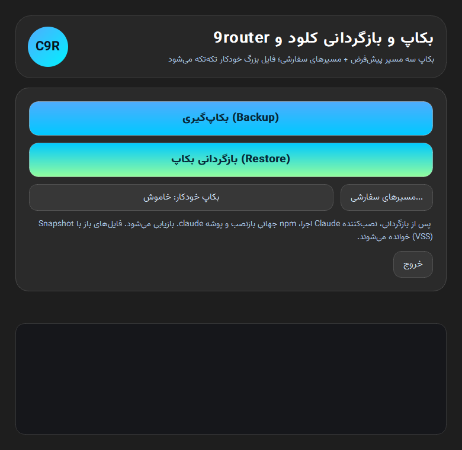

<div align="center">

# 🛡️ Claude9RouterTool

**بکاپ و بازیابی کامل Claude و 9Router — سریع، امن و بدون دردسر**

`v2.4.0` · `Windows` · `Python 3.12` · `PySide6` · **ارسال مستقیم به تلگرام**

[ویژگی‌ها](#-ویژگیها) · [نصب](#-نصب) · [استفاده](#-استفاده) · [نحوه کار](#-نحوه-کار) · [سوالات رایج](#-سوالات-رایج)



</div>

---

## ✨ ویژگی‌ها

### 🎯 بکاپ هوشمند
- **سه مسیر پیش‌فرض** بدون هیچ تنظیمی: `Claude-3p`، `9router` و پوشه `.claude` (تنظیمات و تاریخچه Claude Code)
- **مسیرهای سفارشی بی‌نهایت** — هر پوشه یا فایلی که می‌خوای، با دکمه «مسیرهای سفارشی...» اضافه/حذف کن
- **فایل‌های بزرگ؟ اصلاً مهم نیست** — فایل تکی بزرگ‌تر از ۱۰۰MB به‌صورت خودکار به تکه‌های ۱۹MB شکسته می‌شه (`*.c9chunk`) و موقع بازیابی با **تطبیق اندازه** دوباره سر هم می‌شه
- **Snapshot ویندوز (VSS)** — برنامه‌ای که فایلش بازه؟ مهم نیست! بکاپ از داخل Snapshot لحظه‌ای درایو گرفته می‌شه؛ بدون بستن برنامه، بدون خطا، بدون کرش
- **جایگزینی امن بکاپ قبلی** — اول بکاپ محلی کامل ساخته و کنترل می‌شه، بعد بکاپ جدید به تلگرام ارسال می‌شه؛ فقط اگه همه‌چیز موفق بود، پیام‌های بکاپ قبلی از چت حذف می‌شن 🛡️

### 📨 ارسال به تلگرام
- بکاپ **مستقیماً به چت تلگرام خودت** ارسال می‌شه — بدون سرور، بدون Cloudflare، بدون Backblaze
- **هر جزء ≤۱۹MB** — زیر سقف ۲۰MB دانلود Bot API تلگرام؛ یعنی **بازیابی کاملاً خودکار** حتی برای بکاپ‌های چند گیگابایتی
- فقط **آخرین بکاپ** در چت می‌مونه (رفتار جایگزینی) — پیام‌های بکاپ قبلی خودکار پاک می‌شن
- **شاخص بکاپ** (index.json) حاوی file_id همه اجزاست؛ بازیابی بدون جستجوی دستی
- توکن ربات با **DPAPI ویندوز** (متناسب با کاربر ویندوزت) رمزنگاری و ذخیره می‌شه
- محدودیت نرخ تلگرام (429) خودکار مدیریت می‌شه

### ⏰ بکاپ خودکار
- فاصله دلخواه: **از ۱ تا ۱۴۴۰ دقیقه** — انتخاب با تو
- انتخابت توی `settings.json` ذخیره می‌شه؛ دفعه بعد همون رو پیش‌نهاد می‌ده
- اگه عملیات قبلی هنوز در حال اجرا باشه، دوره جدید به‌آرامی رد می‌شه (بدون تداخل)

### 🔄 بازیابی کامل
- دانلود همه اجزای آخرین بکاپ از تلگرام، استخراج امن (ضد zip-slip)، بازگردانی دقیق با کنترل اندازه
- گام‌های پس از بازیابی به‌صورت خودکار: اجرای نصب‌کننده Claude ← `npm i -g npm` ← `npm i -g 9router`
- سازگاری کامل با بکاپ‌های نسخه‌های قبلی

### 🖥️ رابط کاربری
- تم **Liquid Glass** فارسی، راست‌چین، با فونت **وزیرمتن**
- لاگ زنده لحظه‌ای همه عملیات
- ارتقای خودکار به Administrator (فقط وقتی لازمه)

---

## 📦 نصب

### روش ۱ — فایل آماده (پیشنهادی)
آخرین **Release** رو از [بخش Releases](https://github.com/0smjp0-afk/Claude9RouterTool/releases) دانلود کن، `Claude9RouterTool.exe` رو اجرا کن، تمام.

> فایل EXE تک‌فایلی و مستقله (~۵۰MB)؛ دارایی‌ها (نصب‌کننده Claude + فونت‌ها) داخلش جاسازی شدن.

### روش ۲ — از سورس
```bash
git clone https://github.com/0smjp0-afk/Claude9RouterTool.git
cd Claude9RouterTool
pip install pyinstaller PySide6
# ساخت EXE:
python -m PyInstaller --noconfirm --clean Claude9RouterTool.spec
```

> **پیش‌نیاز:** ویندوز ۱۰/۱۱ · برای بکاپ VSS و npm، یکبار اجرا با Administrator (خود برنامه درخواست می‌ده)

---

## 🚀 استفاده

| دکمه | کار |
|---|---|
| **بکاپ‌گیری (Backup)** | بکاپ کامل + ارسال به تلگرام (بکاپ قبلی چت جایگزین می‌شه) |
| **بازگردانی بکاپ (Restore)** | جدیدترین بکاپ تلگرام دانلود و دقیقاً برمی‌گرده |
| **بکاپ خودکار** | روشن/خاموش + تنظیم فاصله (۱ تا ۱۴۴۰ دقیقه) |
| **مسیرهای سفارشی...** | افزودن/حذف هر پوشه یا فایل دلخواه |
| **اتصال تلگرام...** | توکن ربات + chat_id (یکبار برای همیشه) |
| **خروج** | بستن برنامه |

### 🔌 راه‌اندازی تلگرام (فقط ۲ دقیقه، یکبار برای همیشه)

1. **ساخت ربات:** توی تلگرام به [@BotFather](https://t.me/BotFather) پیام بده → `/newbot` → یه اسم و یوزرنیم بده → توکن (شبیه `123456:AAH...`) رو کپی کن
2. **اتصال:** توی برنامه دکمه «اتصال تلگرام...» رو بزن → توکن رو وارد کن → به رباتت توی تلگرام یه `/start` بده → «ذخیره و فعال‌سازی» — chat_id خودکار شناسایی می‌شه
3. تمام! بکاپ‌گیری رو بزن — بکاپ به چت تلگرامت میاد

**خط فرمان:**
```bash
Claude9RouterTool.exe                # رابط گرافیکی
Claude9RouterTool.exe --selftest    # خودآزمایی داخلی (بدون شبکه)
Claude9RouterTool.exe --shot out.png # رندر پنجره برای تست ظاهر
```

**فایل‌های پیکربندی:**

| فایل | محتوا |
|---|---|
| `%LOCALAPPDATA%\Claude9RouterTool\custom_paths.json` | مسیرهای سفارشی بکاپ |
| `%LOCALAPPDATA%\Claude9RouterTool\settings.json` | تنظیمات (فاصله بکاپ خودکار، chat_id و ...) |
| `%LOCALAPPDATA%\Claude9RouterTool\secrets.dat` | توکن ربات (رمزنگاری‌شده با DPAPI ویندوز) |
| `%LOCALAPPDATA%\Claude9RouterTool\tg_state.json` | شاخص آخرین بکاپ ارسالی به تلگرام |
| `%LOCALAPPDATA%\Claude9RouterTool\logs\` | لاگ کامل هر عملیات |
| `%LOCALAPPDATA%\Claude9RouterTool\backups\` | بکاپ‌های محلی (قبل از ارسال) |

---

## ⚙️ نحوه کار

```
┌─────────────────────────── بکاپ ───────────────────────────┐
│  1. Snapshot (VSS) از درایوهای لازم ساخته می‌شود            │
│  2. فایل‌ها جمع‌آوری و فایل‌های >۱۰۰MB تکه‌تکه می‌شوند       │
│  3. زیپ‌های ≤۱۹MB ساخته می‌شوند + مانیفست JSON + لاگ        │
│  4. ✓ اعتبارسنجی: همه اجزای محلی سالم‌اند؟                 │
│       ├─ خیر → توقف؛ تلگرام دست‌نخورده                     │
│       └─ بله ↓                                             │
│  5. ⬆ همه اجزا + مانیفست + لاگ به چت تلگرام ارسال می‌شوند  │
│  6. 📋 شاخص بکاپ (file_id همه اجزا) ارسال می‌شود           │
│  7. 🗑 پیام‌های بکاپ قبلی چت حذف می‌شوند                    │
│     (اگر ارسال کامل نشد، بکاپ قبلی حفظ و نیمه‌کاره پاک می‌شود)│
│  8. Snapshot پاک‌سازی می‌شود                                │
└────────────────────────────────────────────────────────────┘
```

**فرمت بکاپ:** `backup_YYYYMMDD_HHMMSS_partN.zip` + تکه‌های `*_bigNofM.c9chunk` + مانیفست JSON (فهرست کامل فایل‌ها، مسیرها، اندازه‌ها، تکه‌ها و هشدارها) + شاخص تلگرام. بازیابی از روی مانیفست انجام می‌شه — یعنی حتی پوشه‌های خالی هم بازسازی می‌شن.

**نکته:** فقط **آخرین بکاپ** در چت تلگرام باقی می‌مونه (رفتار جایگزینی) — بقیه پیام‌ها خودکار پاک می‌شن.

---

## ❓ سوالات رایج

**بکاپ چقدر طول می‌کشه؟** به حجم `.claude` و مسیرهای سفارشیت بستگی داره؛ فشرده‌سازی + ارسال معمولاً چند دقیقه‌ست. هر جزء ۱۹MB است، پس بکاپ ۱GB ≈ ۵۴ پیام.

**برنامه‌ای که فایلش بازه رو بست؟** نه! Snapshot ویندوز (VSS) کار خوندن رو انجام می‌ده. فقط اگه VSS در دسترس نباشه، به روش معمولی ادامه می‌ده و در لاگ اطلاع می‌ده.

**بکاپ قبلی‌هام کی رفتن؟** طبق طراحی، هر بکاپ جایگزین قبلی می‌شه — پیام‌های بکاپ قبلی از چت تلگرام پاک می‌شن و فقط آخرین نسخه سالم می‌مونه.

**چرا تکه‌های ۱۹MB؟** Bot API تلگرام اجازه **دانلود** فایل‌های بالای ۲۰MB رو به ربات نمی‌ده. با اجزای ۱۹MB، هم ارسال و هم **بازیابی خودکار** همیشه ممکنه.

**توکن ربات کجا ذخیره می‌شه؟** با DPAPI ویندوز (متناسب با کاربر ویندوزت) رمزنگاری و در `secrets.dat` ذخیره می‌شه — فقط همین کاربر و همین سیستم می‌تونه بازش کنه.

**چرا فایل بکاپ در چت دیده نمی‌شه؟** اگه `has_private_forwards` فعال باشه، تلگرام نمایش برخی فایل‌ها رو محدود می‌کنه ولی دانلود خودکار برنامه با file_id بدون مشکل کار می‌کنه.

**خودآزمایی چی‌کار می‌کنه؟** توی یه سندباکس موقت، کل چرخه بکاپ→تکه‌تکه‌سازی→بازیابی رو **بدون شبکه و بدون اجرای نصب‌کننده‌ها** تست می‌کنه — کاملاً بی‌خطره.

---

<div align="center">

ساخته‌شده با ❤️ برای نگه‌داشتن تنظیمات Claude و 9Router در امان

`سورس محلی: claude9router_tool.py` · `بیلد: PyInstaller` · `UI: PySide6 + Vazirmatn` · `Cloud: Telegram Bot API`

</div>
